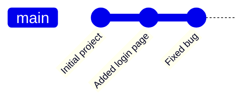
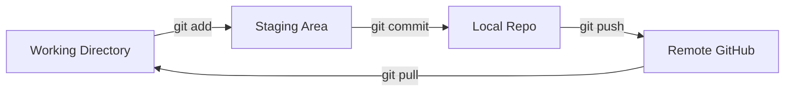

  <h1>📖 Git and GitHub: A Simple Guide</h1>
  
<strong>Core concepts, terminology, and how Git actually works</strong>

  
  

---

## 🤔 What is Git?

Git is a **version control system** that helps track changes in our project files over time.

### Why is it used?

- **Save different versions:** You can save different versions of your project.
- **Rollback:** You can go back to an older version if something breaks.
- **Collaboration:** Multiple people can work on the same project safely.
- **Branching:** You can create branches for new features without damaging the main work.

> [!NOTE]
> Git is like a smart history system for our code.

---

## 🕰️ Why Git Was Created

### Before Git

Developers manually copied folders, leading to names like:

- `project-final`
- `project-final-2`
- `project-final-latest-fixed`

This process becomes messy and dangerous.

### Git Solves This By

- Recording every single change
- Identifying who changed what
- Allowing quick rollbacks
- Supporting multiple developers simultaneously

> [!NOTE]
> Git was created by Linus Torvalds in 2005 for managing the Linux source code.

---

## 🧠 Core Concept: How Git Works

Git tracks **snapshots**, not just individual files.

> [!IMPORTANT]
> If you change only one file in a project and commit the changes, Git does not just track that single file. Instead, Git saves the **entire project state** at that exact moment.

### What is a Commit?

A commit is:

- A checkpoint
- A snapshot
- A saved version of the project

**Timeline Example:**

`commit1 (Initial project)` → `commit2 (Added login page)` → `commit3 (Fixed bug)`

Git allows you to move between these commits at any time.

---

## ⚔️ Git vs. GitHub

| Feature        | Git                                    | GitHub                                                              |
| -------------- | -------------------------------------- | ------------------------------------------------------------------- |
| **Type**       | A tool installed locally on your computer. | A website and cloud platform.                                       |
| **Tracking**   | Tracks changes locally.                | Stores repositories online.                                         |
| **Purpose**    | Version control system.                | Sharing and hosting platform.                                       |
| **Architecture** | Distributed system.                  | Centralized hosting service.                                        |
| **Operations** | Handles local branching and merging.   | Handles Pull Request (PR) reviews.                                  |
| **History**    | Maintains local history and rollbacks. | Hosts local code online so anyone can see and contribute.           |
| **Extras**     | Works completely offline.              | Includes issue tracking, access control, and code reviews.          |

---

## 🔑 Key Terms and Architecture

### Repository (Repo)

This is your project folder. A repo contains all your project files and a hidden `.git` folder that tracks every single change made over time.

📂 What's inside the hidden <code>.git</code> folder?

- History
- Git objects
- Commits
- Configuration
- Branches
- Metadata

**Types of repositories:**

- **Local Repo:** Located entirely on your personal computer.
- **Remote Repo:** Hosted on the internet or a cloud server (like GitHub, GitLab, or Bitbucket) so others can access it.

### Working Directory

This is the current state of the files you are actively editing on your computer. It represents your sandbox environment where changes haven't been saved to Git history yet.

### Staging Area

Think of this as a waiting room. Before you save a snapshot of your code, you must explicitly pick which files (or specific changes) you want to include. This process is called **staging**.

### Commit Details

A saved snapshot of your project at a specific point in time. When you commit, you write a permanent record of your changes.

- Every commit gets a **unique ID** (a long string of numbers and letters called a SHA).
- Every commit requires a **commit message** explaining what you changed and why.

**Each commit contains:**

- Commit message
- Author details
- Timestamp
- References to file snapshots

### HEAD

A pointer that tells Git which branch and commit you are currently looking at on your screen.

### Stash

A temporary clipboard. If you are halfway through a feature but suddenly need to switch to an urgent bug fix, you can stash your unfinished work to clean your working directory without making an incomplete commit. You can pop it back out later.

---

## 🌿 Branching and Merging

One of Git's greatest strengths is allowing multiple people to work on the same project simultaneously without stepping on each other's toes.

### Branch

A parallel timeline for your code. The default timeline is usually called `main` or `master`. If you want to build a new feature, you create a branch to write code freely without messing up the stable, working version of the project.

### Merge

The act of combining two branches together. Once your new feature is finished and tested on your side-branch, you merge it back into the `main` branch to combine your work.

### Merge Conflict

A roadblock when Git gets confused. If you and your teammate edit the exact same line of the same file on different branches and try to merge them, Git won't know whose version to keep. It pauses the merge and asks you to manually choose the correct code.

> [!WARNING]
> Merge conflicts require manual resolution — Git will mark the conflicting sections in your file and you must choose which version to keep.

---

## 🔄 Common Git & GitHub Actions

- **Clone:** Downloading a complete copy of a remote repository from the cloud onto your local computer for the first time.

- **Fetch:** Asking the remote server, *"Hey, has anyone else uploaded new changes?"* Git downloads the tracking data so you can see what your team has done, but it does not alter your local working files yet.

- **Pull:** Fetching changes and immediately blending them into your current local branch. This updates your local code with your team's latest work.

- **Push:** Sending your local commits up to the remote repository (GitHub, GitLab, etc.) so your team can see and use your updated code.

- **Fork:** Creating a personal copy of someone else's remote repository on your own cloud account. This allows you to freely experiment with open-source projects without affecting the original owner's code.

- **Pull Request (PR):** A formal proposal to merge your branch into the main project on platforms like GitHub. A PR opens a discussion page where teammates can review your code, leave feedback, and run automated tests before giving the green light to merge.

- **Cherry-pick:** The act of hand-picking a single commit from one branch and applying it directly to another without merging the entire branch.

- **Gitignore:** A special text file in a repository named `.gitignore`. You list files or folders inside it (like `.env`, passwords, database files) that you want Git to completely ignore so they are never accidentally tracked or pushed to the cloud.

> [!CAUTION]
> Never push sensitive data like passwords, API keys, or `.env` files to GitHub — always add them to `.gitignore` first.

---

| ⬅️ Previous | 🏠 Home | Next ➡️ |
|:---:|:---:|:---:|
| [Git Installation](./0.Git%20Installation.md) | [README](../README.md) | [Repository Setup](./2.%20Repository%20Setup.md) |

