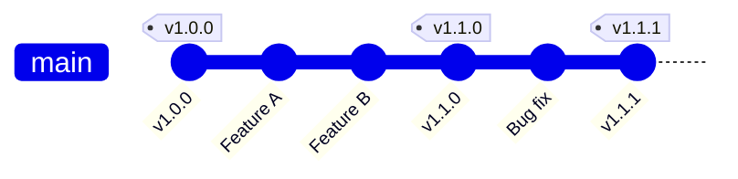

  <h1>🏷️ Git Tags: Managing Versions and Releases</h1>
  
<strong>Mark important milestones with version tags</strong>

  
  

---

## 👀 Viewing and Creating Tags

- **`git tag`**  
  Displays a simple list of all specific release version tags saved in your repository.

- **`git tag <tag-name>`**  
  Places a simple reference tag (like a bookmark) right on top of your current commit.

- **`git tag -a <tag-name> -m "message"`**  
  Builds an annotated release tag with an official description message.

- **`git tag -a <tag-name> <commit-id> -m "message"`**  
  Creates an annotated tag on an older historical commit instead of your current `HEAD`.

> [!TIP]
> Always use annotated tags (`-a`) for releases — they store the tagger's name, date, and message, making them much more informative than lightweight tags.

---

## ☁️ Pushing and Fetching Tags

- **`git push origin <tag-name>`**  
  Sends a specific local release version tag up to your remote cloud repository.

- **`git push origin --tags`**  
  Mass uploads all local release tags up to the remote cloud server.

- **`git fetch --tags`**  
  Downloads all production version release tags hosted on the remote server into your local project environment.

> [!IMPORTANT]
> Tags are **not** pushed automatically with `git push` — you must explicitly push them with `git push origin --tags` or specify individual tag names.

---

## 🗑️ Deleting and Modifying Tags

- **`git tag -d <tag-name>`**  
  Deletes a specific version release tag from your local computer.

- **`git push origin --delete <tag-name>`**  
  Deletes the specified tag from the remote cloud repository.

- **`git tag -f <tag-name> <commit-id>`**  
  Forcefully reassigns an existing tag name to a specific commit ID (or to your current commit if no ID is specified).

> [!WARNING]
> Force-moving a tag that's already been pushed can confuse collaborators — coordinate with your team before reassigning pushed tags.

---

## 🔎 Inspecting and Filtering Tags

- **`git show <tag-name>`**  
  Shows the tagged commit, message, code changes, and metadata, allowing you to open and inspect that specific release version.

- **`git describe`**  
  Shows the closest tag relative to your current commit.

- **`git tag -l "<pattern>"`**  
  Filters and lists tags matching a specific keyword or naming pattern.

- **`git tag --sort=-v:refname`**  
  Displays tags sorted cleanly by their version numbers.

- **`git checkout <tag-name>`**  
  Moves your project workspace to the exact state of that tagged version.

> [!NOTE]
> Checking out a tag puts you in "detached HEAD" state — you can look around, but create a new branch if you want to make changes from that point.

---

⚡ Quick Reference — All Tag Commands

| Command | Purpose |
|---------|---------|
| `git tag` | List all tags |
| `git tag <name>` | Create lightweight tag |
| `git tag -a <name> -m "msg"` | Create annotated tag |
| `git push origin <tag>` | Push one tag |
| `git push origin --tags` | Push all tags |
| `git fetch --tags` | Download remote tags |
| `git tag -d <name>` | Delete local tag |
| `git push origin --delete <tag>` | Delete remote tag |
| `git tag -f <name> <commit>` | Move tag to commit |
| `git show <tag>` | Inspect tag details |
| `git describe` | Find nearest tag |
| `git tag -l "pattern"` | Filter tags |
| `git checkout <tag>` | Go to tagged version |

---

| ⬅️ Previous | 🏠 Home | Next ➡️ |
|:---:|:---:|:---:|
| [Stashing](./11.%20Stashing.md) | [README](../README.md) | [Submodules and Subtrees](./14.%20Submodules%20and%20Subtrees.md) |

