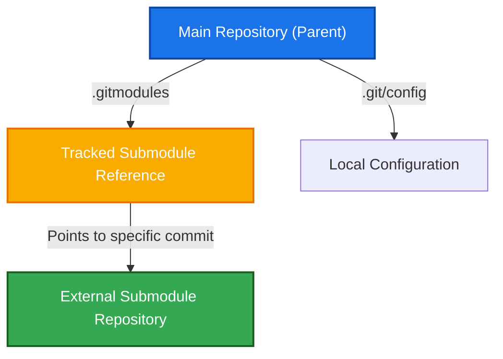

<div align="center">
  <h1>🧩 Git Submodules and Subtrees</h1>
  <p><strong>Managing nested repositories and external dependencies</strong></p>
  
  
  
</div>

---

## 📎 Git Submodules



A Git submodule is a way to include one Git repository inside another Git repo while keeping both projects separate. The external project has its own files, commits, branches, and history. The main project does not copy all files; instead, it remembers which version (commit) of the project should be used.

### 📌 Add a Submodule (`git submodule add`)

Add an external repository as a submodule to your parent repository:

```bash
# ➕ Add an external repository as a submodule
git submodule add <git url>
```

### 📌 Initialize Submodule Configuration (`git submodule init`)

Reads the submodule information from `.gitmodules` and copies it into your local `.git/config` file. This way, Git knows that a particular folder is actually a separate repo, where it is located, and from which URL it should be fetched for tracking.

```bash
# ⚙️ Initialize local configuration for submodules
git submodule init
```

### 📌 Download Submodule Files (`git submodule update`)

The first time when we download it, if that repo had a commit our main repo remembers (or after we deleted the local repo, downloaded it again, and ran the update command), it directly goes to that commit. It does not care about new commits, much like `git checkout`.

```bash
# 📥 Update submodules to the commit version stored in the parent repo
git submodule update
```

### 📌 Check Submodule Status (`git submodule status`)

Shows the commit that the main repo remembers, and `git submodule update` uses that commit to restore the exact version.

```bash
# 🔍 Check the commit ID status of submodules
git submodule status
```

### 📌 Deinitialize Submodule (`git submodule deinit`)

Removes the local tracking / configuration of the submodule.

```bash
# ❌ Remove local tracking configuration for a submodule
git submodule deinit <path-to-submodule>
```

### 📌 Update Submodule to Latest Commit (`git submodule update --remote`)

Moves the submodule to the latest commit from its remote branch, so you can see the newest version instead of the old commit remembered by the main repo.

```bash
# ☁️ Fetch latest changes from submodule's remote repository
git submodule update --remote
```

> [!IMPORTANT]
> After running `git submodule update --remote`, you must stage and commit the change in the main repo to update the tracked commit pointer.

```bash
# ➕ Stage the updated submodule commit pointer
git add <repo name>

# 📸 Commit the change in the parent repository
git commit -m "Update submodule reference to latest remote commit"
```

### 📌 Run Commands in All Submodules (`git submodule foreach`)

It goes into every submodule and runs the specified command (e.g. status, pull, etc.).

```bash
# 🌀 Run git status inside every submodule folder
git submodule foreach git status
```

### 📌 Recursive Submodule Operations

If we had a lot of submodule repos, deleted them all, and redownloaded them, running this command returns all of them back to their old state.

```bash
# 🔄 Update all submodules and nested submodules recursively
git submodule update --recursive
```

Or initialize and update them all at the same time:

```bash
# 🔄 Initialize and update submodules recursively in one command
git submodule update --init --recursive
```

### 📌 Clone with Submodules (`git clone --recurse-submodules`)

Downloads the main repo and all sub-repos directly to the commits that the main repo remembers.

```bash
# 📥 Clone remote repository along with all its submodules automatically
git clone --recurse-submodules <repository-url>
```

> [!TIP]
> Always clone with `--recurse-submodules` when a project uses submodules — otherwise you'll get empty submodule folders.

If you already cloned without submodules, you can initialize and download them using:

```bash
# ⚙️ Set up tracking and download submodules for an already cloned repo
git submodule update --init
```

### 📌 Synchronize Submodule URLs (`git submodule sync`)

Updates my local Git config so it uses the new submodule URL instead of the old URL.

```bash
# 🔗 Sync local submodule configuration to matching URLs in .gitmodules
git submodule sync
```

> [!WARNING]
> Submodules can be tricky for teams — everyone must remember to `init` and `update` them after cloning.

---

## 🌲 Git Subtrees

Git subtrees allow you to include another repository as a subdirectory of your project. Unlike submodules, the code is fully merged into your project history, so your teammates don't need any extra setup.

### 📌 Add a Subtree (`git subtree add`)

Used for tracking. It copies only a specific branch's files and commits from a repo, stores those files in a folder, and merges that branch's commits into our main repo.

```bash
# 🌲 Add external repository as a subdirectory (subtree)
git subtree add --prefix=calculator <repo-url> main
```

### 📌 Pull Subtree Updates (`git subtree pull`)

Pulls new changes from that branch.

```bash
# 📥 Pull the latest changes for the subtree folder
git subtree pull --prefix=calculator <repo-url> main
```

### 📌 Push Subtree Changes (`git subtree push`)

Takes the changes I made and pushes them to the original repo branch.

```bash
# 📤 Push subtree modifications back to the external repository
git subtree push --prefix=calculator <repo-url> main
```

> [!NOTE]
> Subtrees are simpler than submodules for teams — the external code lives directly in your repo, so teammates don't need any extra setup after cloning.

---

<details>
<summary>⚡ Quick Reference — Submodules vs Subtrees</summary>

| Feature | Submodules | Subtrees |
|---------|:---:|:---:|
| External repo stays separate? | ✅ | ❌ (merged in) |
| Teammates need extra setup? | ✅ (init + update) | ❌ |
| Has its own history? | ✅ | ❌ (merged history) |
| Complexity | 🔴 Higher | 🟢 Lower |

</details>

<details>
<summary>⚡ Quick Reference — All Commands</summary>

| Command | Purpose |
|---------|---------|
| `git submodule add <url>` | Add a submodule |
| `git submodule init` | Set up local tracking |
| `git submodule update` | Download to remembered commit |
| `git submodule status` | Check submodule state |
| `git submodule deinit` | Remove local config |
| `git submodule update --remote` | Get latest from remote |
| `git submodule foreach status` | Check all submodules |
| `git submodule update --init --recursive` | Init + update all |
| `git clone --recurse-submodules` | Clone with submodules |
| `git submodule sync` | Update URLs |
| `git subtree add --prefix=<dir> <url> <branch>` | Add subtree |
| `git subtree pull --prefix=<dir> <url> <branch>` | Pull subtree updates |
| `git subtree push --prefix=<dir> <url> <branch>` | Push subtree changes |

</details>

---

<div align="center">

| ⬅️ Previous | 🏠 Home |
|:---:|:---:|
| [Tags and Releases](./12.%20Tags%20and%20Releases.md) | [README](../README.md) |

</div>