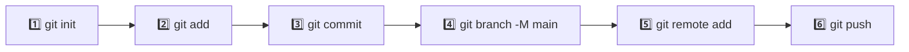

<div align="center">
  <h1>🏗️ Repository Setup: Step-by-Step</h1>
  <p><strong>Start a new project with Git and connect it to GitHub from scratch</strong></p>
  
  
</div>

---

How to start a new project with Git and connect it to GitHub from scratch.



---

### 📌 Step 1: Initialize a Local Repository

Go to your project folder in your terminal and run:

```bash
# 🎯 Turn your folder into a Git repository
git init
```

> [!NOTE]
> This creates that hidden `.git` folder inside your project. Your ordinary folder is now a smart Git repository!

---

### 📌 Step 2: Track Your Files (Staging Area)

Before saving a snapshot, you must explicitly pick which files you want to include by putting them in the "waiting room":

- **To add a single specific file:**

  ```bash
  # ➕ Stage one file
  git add filename.txt
  ```

- **To add every single file in the folder at once:**

  ```bash
  # ➕ Stage all files
  git add .
  ```

---

### 📌 Step 3: Save Your First Snapshot (Commit)

Now, permanently save your staged files into your local history with a short, helpful message:

```bash
# 📸 Create your first commit
git commit -m "Initial commit"
```

---

### 📌 Step 4: Rename the Default Branch

GitHub uses `main` as its default branch name. Run this command to ensure your local branch matches GitHub perfectly:

```bash
# 🔄 Rename branch to main
git branch -M main
```

---

### 📌 Step 5: Link Local Repo to GitHub (Remote)

Go to GitHub, create a new empty repository, copy the URL, and link your local computer to that cloud repository:

```bash
# 🔗 Connect to GitHub
git remote add origin https://github.com/your-username/your-repo-name.git
```

> [!TIP]
> `origin` is just a shortcut nickname Git uses to remember your remote cloud link so you don't have to type the whole URL every time.

---

### 📌 Step 6: Push Your Code to the Cloud

Send your local saved commits up to GitHub for the very first time:

```bash
# ☁️ Push to GitHub
git push -u origin main
```

> [!IMPORTANT]
> The `-u` flag sets up tracking so future pushes only need `git push` — no need to type the full command again.

---

<div align="center">

| ⬅️ Previous | 🏠 Home | Next ➡️ |
|:---:|:---:|:---:|
| [Git Fundamentals](./1.%20Git%20Fundamentals.md) | [README](../README.md) | [Git Configuration](./3.%20Git%20Configuration.md) |

</div>