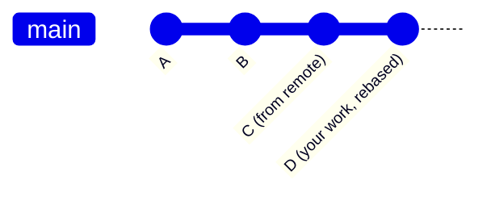

<div align="center">
  <h1>🔧 Git Configuration and Global Settings</h1>
  <p><strong>Set up your identity, aliases, and advanced Git preferences</strong></p>
  
  
</div>

---

## 👤 Setting Up Your Identity

To configure your global identity, use the following commands:

```bash
# 🏷️ Set your name and email globally
git config --global user.name "your name"
git config --global user.email "your mail"
```

Git attaches this identity information to every commit you create.

### Example

```bash
# 📸 Commit with your identity attached
git commit -m "added authentication"
```

Git stores metadata like:

- **Author:** Balaji
- **Email:** balaji@gmail.com
- **Date:** [Timestamp]
- **Message:** Added authentication commit

### Why Git Needs This

Git is a **distributed version control system** where multiple developers may contribute to the same repository. Git must know:

- Who created each commit
- Who modified the code
- Ownership of changes

> [!IMPORTANT]
> Always set your identity before making your first commit — otherwise Git will reject it or use placeholder values.

---

## ⚡ Configuration List and Shortcuts (Aliases)

- <kbd>git config --list</kbd> - Lists all configuration settings.
- <kbd>git config --global alias.&lt;alias-name&gt; &lt;actual-command&gt;</kbd> - Creates a shortcut for a command.

### Example

```bash
# ✨ Create a shortcut: "git st" instead of "git status"
git config --global alias.st status
```

Now, instead of typing `git status`, you can simply use `git st`.

- <kbd>git config --global --list</kbd> - Used to see all the global configurations you have set up.

> [!TIP]
> Create aliases for commands you use daily — it saves a surprising amount of time!

---

## 🚀 Advanced Global Settings

### Shorter Pushing

```bash
# ⚡ Push current branch without specifying name
git config --global push.default current
```

Instead of running `git push origin feature` every time, you can just use `git push`. Git will automatically push the branch you are currently working on.

### Cleaner History with Rebase

```bash
# 📏 Keep commit history straight and clean
git config --global pull.rebase true
```

Git puts your work on top of the latest changes instead of creating extra merge commits.

**How it works:**

- GitHub/Online has: `A -> B -> C`
- You have locally: `A -> B -> D`
- Git temporarily removes your commit `D`, downloads `C`, and then places your commit `D` back on top.
- **Result:** `A -> B -> C -> D` (Clean history)



### Setting the Default Text Editor

```bash
# ✏️ Use VS Code as Git's editor
git config --global core.editor "code --wait"
```

Defines which text editor Git should open (like Notepad, Vim, Nano) when it needs user input. Whenever you are writing a commit message, it opens this editor.

### Enabling Terminal Colors

```bash
# 🎨 Make Git output colorful and readable
git config --global color.ui true
```

Enables colorized terminal output to improve readability, displaying Git information using colors.

---

## 🗂️ Managing Configurations

- <kbd>git config --show-origin --list</kbd> - Displays all configuration values along with the file where each setting is defined.
- <kbd>git config --global --edit</kbd> - Opens the global Git configuration file in your configured editor, letting you manually edit all Git settings.
- <kbd>git config --global --unset user.name</kbd> - Removes the `user.name` entry from your global Git configuration file.
- <kbd>git config user.name</kbd> or <kbd>git config --get user.name</kbd> - Used to display the value stored for this specific setting.

> [!NOTE]
> There are hundreds of configuration settings, so there is no need to memorize them all:
>
> - `user.name` / `user.email`
> - `core.pager`
> - `color.ui`
> - `core.editor`
> - `core.autocrlf`
> - `core.filemode`
> - `core.ignorecase`

---

<details>
<summary>⚡ Quick Reference — All Config Commands</summary>

| Command | Purpose |
|---------|---------|
| `git config --global user.name "name"` | Set your name |
| `git config --global user.email "email"` | Set your email |
| `git config --global alias.st status` | Create shortcut |
| `git config --global push.default current` | Auto-push current branch |
| `git config --global pull.rebase true` | Clean pull history |
| `git config --global core.editor "code --wait"` | Set default editor |
| `git config --global color.ui true` | Enable colors |
| `git config --list` | List all settings |
| `git config --global --edit` | Edit config file |
| `git config --global --unset user.name` | Remove a setting |

</details>

---

<div align="center">

| ⬅️ Previous | 🏠 Home | Next ➡️ |
|:---:|:---:|:---:|
| [Repository Setup](./2.%20Repository%20Setup.md) | [README](../README.md) | [Staging and Committing](./4.%20Staging%20and%20Committing.md) |

</div>
