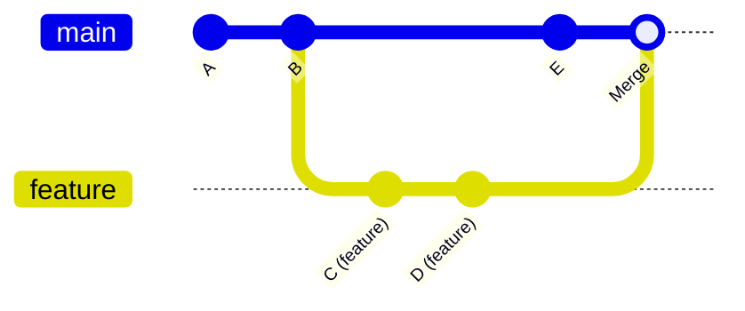

<div align="center">
  <h1>🌿 Git Branching Commands</h1>
  <p><strong>Branch management, merge strategies, and parallel development</strong></p>
  
  
</div>

---

> [!IMPORTANT]
> A Git branch is not a folder copy of the entire project. It is simply a movable pointer (reference) to a specific commit. Every new commit you make moves that active branch pointer forward. However, the `main` pointer does not move on its own; it stays exactly where it is until you make changes directly in the `main` branch or merge code into it.



---

## 🔀 Essential Branching Commands

- **`git branch`**  
  Lists all the branches currently available in your local repository.

- **`git branch <branch-name>`**  
  Creates a brand-new parallel timeline (branch) with a custom name.

- **`git checkout <branch-name>`** (or **`git switch`**)  
  Switches your active workspace to an existing branch timeline.

- **`git checkout -b <branch-name>`**  
  A combined shortcut command for creating a brand-new branch and instantly switching your workspace into it.

> [!TIP]
> `git switch` is the modern, safer alternative to `git checkout` for switching branches — it only handles branches, reducing accidental file operations.

- **`git merge <branch-name>`**  
  Integrates and blends the code history of the specified branch into your current active branch timeline.

- **`git rebase <branch-name>`**  
  Takes all the unique commits made on your current branch and replays them cleanly on top of another branch. This helps you avoid creating an extra merge commit, keeping your timeline completely straight.

> [!WARNING]
> Never rebase commits that have already been pushed to a shared remote branch — it rewrites history and will cause conflicts for your teammates.

- **`git branch -d <branch-name>`**  
  Deletes a specified local branch, but it will only allow you to do so if its changes have already been safely merged into another branch.

- **`git branch -D <branch-name>`**  
  Forcefully deletes a local branch immediately, even if it still contains unmerged code changes that might be lost.

> [!CAUTION]
> `git branch -D` force-deletes without checking if changes are merged — unmerged work will be lost permanently.

- **`git remote set-head origin <branch-name>`**  
  Updates your local machine's tracking profile to point to the designated default branch of the remote repository.  
  *Note: This only affects your local tracking references and does not modify any properties directly on the remote cloud server.*

---

## 🔃 Advanced Merging: Fast-Forward vs. No Fast-Forward (`--no-ff`)

- **`git merge --no-ff <branch-name>`**  
  Forces Git to create a merge commit, which generates a clear visual graph of the merging branch in your history.

### How it works:

- **Fast-Forward Merge:** If your `main` branch has no new commits, but your `feature` branch has new commits, running a basic `git merge` will simply slide the `main` pointer forward directly to the end of the feature branch. It does not create a separate visual "merge graph branch" because there were no conflicting changes on `main`.

- **No Fast-Forward Merge (`--no-ff`):** If you want to explicitly document that a branch was created and merged—even if `main` has no new commits—you use `--no-ff`. This forces Git to create a beautiful, visual history graph showing where the branch split off and where it joined back into `main`. If `main` already has its own unique commits, Git will automatically create this visual graph during a merge.

```diff
- git merge feature          # May fast-forward (no merge commit)
+ git merge --no-ff feature  # Always creates a merge commit with visual history
```

---

<details>
<summary>⚡ Quick Reference — All Branching Commands</summary>

| Command | Purpose |
|---------|---------|
| `git branch` | List all local branches |
| `git branch <name>` | Create a new branch |
| `git checkout <name>` / `git switch <name>` | Switch to a branch |
| `git checkout -b <name>` | Create + switch in one step |
| `git merge <name>` | Merge branch into current |
| `git merge --no-ff <name>` | Merge with visible history |
| `git rebase <name>` | Replay commits on top |
| `git branch -d <name>` | Safe delete (merged only) |
| `git branch -D <name>` | Force delete |

</details>

---

<div align="center">

| ⬅️ Previous | 🏠 Home | Next ➡️ |
|:---:|:---:|:---:|
| [Viewing and Comparing](./5.%20Viewing%20and%20Comparing.md) | [README](../README.md) | [Reverting and Resetting](./7.%20Reverting%20and%20Resetting.md) |

</div>