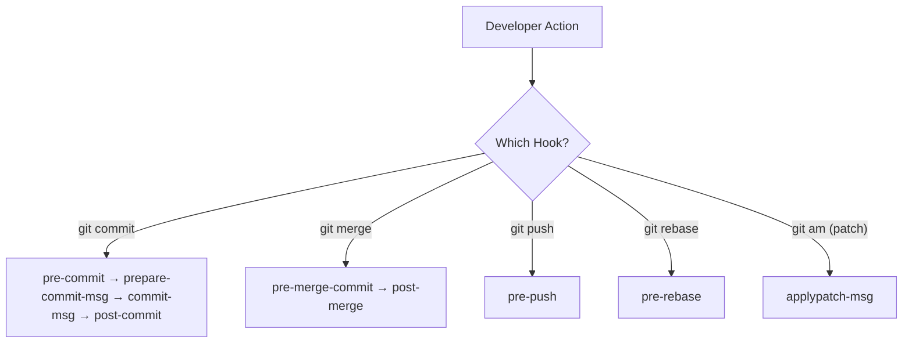

  <h1>🤖 Git Automation Hooks & Patch Management</h1>
  
<strong>Automate workflows with Git hooks and share changes with patches</strong>

  
  

---

## 🪝 What are Git Hooks?

Git Hooks are small scripts stored inside the hidden `.git/hooks/` folder that Git runs automatically when certain events happen. They are highly useful tools used to:

- Stop bad or broken commits.
- Check and enforce commit message formats.
- Run automated tests before pushing code.
- Clean up the local environment after a merge.
- Prevent dangerous history changes and validate patches.

> [!NOTE]
> Hooks are local by default — they live inside `.git/hooks/` and are **not** shared via push/pull. To share hooks across a team, store them in a project folder and symlink them.

---

## 📬 Patch Management Commands & Hooks

Patches allow developers to share code changes as text files. Git provides tools to create, view, and apply these patches safely.

### 📝 Patch Commands

- **`git format-patch -1`**  
  Creates a patch file from your single latest commit.

- **`git format-patch -3`**  
  Creates separate patch files for the last 3 commits.

- **`git format-patch <old-commit> <new-commit>`**  
  Creates patches for all the commits that occurred between two specific commit points.

- **`git am <patch-file>`**  
  Reads a patch file, extracts the commit message and author information, applies the code changes, and automatically creates a new commit.

- **`git am <patch1> <patch2>`**  
  Applies multiple patch files in a row.

- **`git am --abort`**  
  Completely cancels the patch application process and returns your repository to the exact state it was in before you ran `git am`.

- **`git am --continue`**  
  Resumes applying a patch after you have manually resolved a merge conflict.

- **`git am --skip`**  
  Skips the current patch file in the queue and moves on to the next one.

- **`git apply <patch-file>`**  
  Applies the code changes from a patch file directly to your working directory without creating an automatic commit.

### 🪝 Patch Hooks

- **`applypatch-msg`**  
  This hook checks the patch file sent by a developer. It automatically reads the commit message, author information, and code changes to decide whether to commit or reject the patch. It is used to maintain code quality, check the commit message format, run tests, prevent broken patches, and protect the repository from bad updates.

---

## 💻 Client-Side Hooks (Local Hooks)

These hooks run locally on your personal computer whenever you perform actions like committing, merging, or pushing.

### 1. ✍️ Committing Hooks

- **`pre-commit`**  
  Runs right before a commit is created (the moment you type `git commit`). It acts as a gatekeeper to inspect the code. It is commonly used to run code linters, execute automated unit tests, check code formatting, block commits that contain syntax errors, ensure only allowed files are included, and stop sensitive secrets (like passwords or API keys) from being accidentally committed.

> [!TIP]
> Use `pre-commit` hooks with tools like [Husky](https://typicode.github.io/husky/) or [pre-commit](https://pre-commit.com/) to automate code quality checks across your team.

- **`prepare-commit-msg`**  
  Runs after the staging area is set but right *before* the commit message text editor opens for the user. It prepares the default text for the commit message. It is used to pre-fill commit message templates, automatically add the active branch name or a Jira project ticket number, and guide developers to write consistent messages.

- **`commit-msg`**  
  Runs right after you finish writing your commit message but *before* the commit is permanently saved to history. This hook checks whether the written message follows the team's required formatting rules and rejects the commit if the message is invalid.

- **`post-commit`**  
  Runs immediately after a commit is successfully created. It cannot stop a commit because the commit is already done. Instead, it is used to perform extra follow-up tasks like sending a team notification, triggering a desktop alert, updating local log files, or running a secondary script.

### 2. 🔀 Merging & Rebasing Hooks

- **`pre-merge-commit`**  
  Runs right before Git finalizes an automatic merge commit. It verifies whether the merge is acceptable by running final tests, stopping unsafe merges, and enforcing company merge policies.

- **`post-merge`**  
  Runs after a merge operation successfully finishes. Because a merge can bring in brand-new files, updated configurations, or new project dependencies, this hook is used to automatically update your local environment by doing things like installing missing dependencies, refreshing build caches, regenerating files, or updating environment settings.

- **`pre-rebase`**  
  Runs right before a rebase operation begins to check if it is allowed. Because rebasing rewrites commit history (which can be highly risky), this hook can step in to stop a rebase—preventing developers from accidental history rewriting, protecting important development branches, or blocking rebases on protected project history.

> [!WARNING]
> `pre-rebase` is your safety net against accidental history rewrites — configure it to block rebases on `main` and `production` branches.

### 3. ☁️ Pushing & Sharing Hooks

- **`pre-push`**  
  Runs right before Git pushes your local commits up to a remote cloud repository. This is a major safety hook used to run a full integration test suite, check for build success, validate branch protection rules, and block broken code from ever being pushed online.

- **`sendmail-validate`**  
  Runs when Git is configured to send code patches directly via email. It checks the patch's structural metadata and message format to prevent invalid or broken email patch submissions.

---

## 🖥️ Server-Side Hooks

These hooks run directly on the central remote Git server (like GitHub, GitLab, or a private server), not on your laptop. They are used to enforce administrative rules and control exactly what code gets accepted into the server's repository.

- **`pre-receive`**  
  Runs the moment the server receives a push from a developer, before any references are actually updated. The server inspects all the pushed code at once. If any part of the code breaks an established rule, the server rejects the entire push. It is used to block unsafe code, protect the `main` branch, and strictly enforce company-wide rules.

- **`update`**  
  Works similarly to `pre-receive`, but it runs separately for *each individual branch* or reference being updated in the push. If a single push contains updates for multiple branches, this hook inspects them one by one, allowing it to accept an update for one branch while rejecting another based on branch-specific permissions and rules.

- **`post-update`**  
  Runs after the entire push has been fully accepted and saved by the server repository. It cannot reject a push. Instead, it is used to notify other internal systems, refresh background mirrors, trigger automated continuous integration (CI) deployment scripts, or refresh external webhooks.

> [!CAUTION]
> Server-side hooks cannot be bypassed by developers — they are the final enforcement layer. Make sure `pre-receive` rules are well-tested before deploying them.

---

⚡ Quick Reference — All Hook Types

| Hook | When It Runs | Can Block? |
|------|-------------|:---:|
| `pre-commit` | Before commit is created | ✅ |
| `prepare-commit-msg` | Before editor opens | ✅ |
| `commit-msg` | After message, before save | ✅ |
| `post-commit` | After commit is done | ❌ |
| `pre-merge-commit` | Before merge commit | ✅ |
| `post-merge` | After merge completes | ❌ |
| `pre-rebase` | Before rebase starts | ✅ |
| `pre-push` | Before push to remote | ✅ |
| `pre-receive` | Server: before accepting push | ✅ |
| `update` | Server: per-branch check | ✅ |
| `post-update` | Server: after push accepted | ❌ |

---

| ⬅️ Previous | 🏠 Home | Next ➡️ |
|:---:|:---:|:---:|
| [Reverting and Resetting](./7.%20Reverting%20and%20Resetting.md) | [README](../README.md) | [Stashing](./11.%20Stashing.md) |

