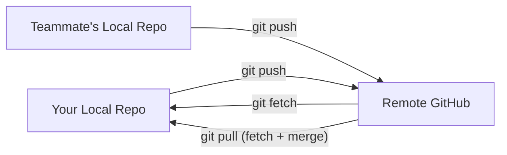

  <h1>🌐 Git Remote Commands</h1>
  
<strong>Working with GitHub, remote repositories, and team collaboration</strong>

  
  

---

## 🔗 Managing Remotes

- **`git remote`**  
  Lists all connected remote server aliases (like `origin`) along with their direct fetch and push web URLs.

- **`git remote add <name> <url>`**  
  Links a brand-new remote cloud repository link to your local project directory. The `<name>` acts as a short name (alias) for that repository.

- **`git remote remove <name>`**  
  Disconnects and removes an established remote cloud link setting from your local configuration.

### Why Use Multiple Remotes?

Having multiple remotes is commonly used for:

- Backups
- Mirrors
- Fork workflows
- Deploying code to different servers
- Collaborating across different repositories
- Migrating between repositories

> [!TIP]
> Name your remotes descriptively: `origin` for your repo, `upstream` for the original fork source, `deploy` for production servers.

---

## ⬆️⬇️ Pushing & Pulling Code

- **`git push origin <branch-name>`**  
  Pushes your specific local branch changes straight to the cloud repository. It only transfers your commits and updates remote branch references. After pushing, you can create a Pull Request (PR) on GitHub so others can view the code, review it, and suggest fixes. If everything looks good, it can be merged into `main`.

- **`git push -u origin <branch-name>`**  
  Pushes your branch to the remote repository while setting it as the "upstream" tracking default for future shorthand pushes. When you use `-u`, it configures that branch as the upstream default, meaning only the commits in that specific branch are pushed to the tracked remote branch in the future.

- **`git fetch origin`**  
  Downloads all the changes made in the remote repository by your teammates and brings those changes into your local Git database, but it does **not** apply or merge any changes into your local working project files yet.

- **`git pull origin <branch-name>`**  
  Fetches and immediately merges updates from a specific branch on the cloud into your local computer. Git checks which remote branch your current local branch is connected to (tracking), using the upstream configuration to sync your local default branch and the remote tracking branch.

> [!NOTE]
> `git pull` = `git fetch` + `git merge`. If you want more control, fetch first, review the changes, then merge manually.

---

## 🔍 Inspecting Remote and Local States

- **`git branch -vv`**  
  Shows a list of local branches along with their tracking state. It displays:
  - The local branches
  - Their latest commit
  - Whether they track a remote branch
  - Their synchronization state (whether they are ahead, behind, or out-of-date)

- **`git remote show origin`**  
  Shows how your current project's local Git is configured to interact with GitHub. It displays:
  - **Remote identity:** Details if you are using SSH-based Git access, ensuring fetch and push go to the same repository with no split setup.
  - **HEAD branch:** The default remote branch.
  - **Remote branches section:** Lists the remote branches available.
  - **Push/Pull mapping:** Shows how local and remote branches link (e.g., `main` pushes to `main`).
  - **Branch status:** Shows if branches are up-to-date or if your local setup is out-of-date.

- **`git branch -r`**  
  Lists all the branches that currently exist in the remote repository.

---

## 📡 Remote History & File Inspection

- **`git log origin/main`**  
  Displays the remote history commit snapshots.

- **`git show origin/main`**  
  Shows the latest commit details on `origin/main`. This includes:
  - Commit metadata (hash, author, date, and message)
  - Which files were changed
  - What exact lines were added or removed

- **`git show --name-only origin/main`**  
  Displays only the names of the files changed in the latest commit along with the commit metadata, without showing the detailed changed lines.

- **`git ls-tree -r origin main`**  
  Displays all the files that are stored in the remote repository, showing only their names.

---

## ⚙️ Advanced Remote Configurations

- **`git remote set-head origin main`**  
  Sets the remote default branch pointer (`origin/HEAD` → `origin/main`) in your local Git configuration.

- **`git remote set-url origin <new-url>`**  
  Tells Git to use a new web URL (either SSH or HTTPS) to connect to your GitHub repository.

> [!TIP]
> Switching from HTTPS to SSH? Use `git remote set-url origin git@github.com:user/repo.git` — no more typing passwords on every push.

---

⚡ Quick Reference — All Remote Commands

| Command | Purpose |
|---------|---------|
| `git remote` | List remotes |
| `git remote add <name> <url>` | Add a new remote |
| `git remote remove <name>` | Remove a remote |
| `git push origin <branch>` | Push to remote |
| `git push -u origin <branch>` | Push + set upstream |
| `git fetch origin` | Download remote changes |
| `git pull origin <branch>` | Fetch + merge |
| `git branch -vv` | Show tracking status |
| `git remote show origin` | Full remote info |
| `git branch -r` | List remote branches |
| `git remote set-url origin <url>` | Change remote URL |

---

| ⬅️ Previous | 🏠 Home | Next ➡️ |
|:---:|:---:|:---:|
| [Reverting and Resetting](./7.%20Reverting%20and%20Resetting.md) | [README](../README.md) | [GitHub Workflow](../GitHub/10.%20GitHub%20Workflow.md) |

