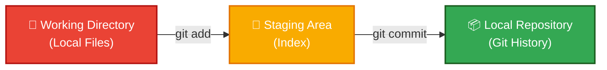

<div align="center">
  <h1>⚡ Git Core Commands & Interactive Staging Guide</h1>
  <p><strong>Essential daily commands and the power of partial staging</strong></p>
  
  
  
</div>

---

## 🔰 Basic Git Commands

To get started with Git on a daily basis, these are the core commands you will use to manage your workflow:

### 📌 Initialize a Repository (`git init`)

Initializes a brand-new, empty Git repository inside your current project folder/directory.

```bash
# 🎯 Turn your current directory into a Git repository
git init
```

### 📌 Clone a Remote Repository (`git clone`)

Downloads a complete, identical copy of an existing repository from a remote cloud onto your local machine.

```bash
# 📥 Download a repository from GitHub/GitLab
git clone <url>
```

### 📌 Check Repository Status (`git status`)

Displays which files are currently modified, which ones are staged, and which files are untracked.

```bash
# 🔍 View status of your working files and staging area
git status
```

### 📌 Stage Files (`git add`)

Takes modified files and places them into the staging area, marking them as ready to be saved.

```bash
# ➕ Stage a specific file for committing
git add <file>
```

### 📌 Save Staged Changes (`git commit`)

Permanently saves your staged changes into your local repository timeline alongside an explanatory message. It creates a snapshot of the entire project at that time, not just the modified files.

```bash
# 📸 Commit staged files with a descriptive message
git commit -m "<message>"
```

> [!TIP]
> Write commit messages in the imperative tense: "Add login page" not "Added login page" — it reads like a command.

---

## 🎯 Interactive Staging: `git add -p`

Git does not automatically understand the difference between your **debug code**, **important code**, or **temporary code**. It only tracks what you explicitly stage and commit.

If you do not stage a debug line, it stays only in your local file—it is not committed, and it is not pushed to GitHub. This helps developers make clean commits by including only the required changes and excluding temporary or unwanted code.

### The Big Idea: Git's Three Stages



<kbd>git add -p</kbd> (or patch mode) sits right in the middle. It allows for **partial staging**. This means you can choose to stage:

- Only one specific function
- Only a single line
- Only bug-fix code while leaving out debug logs or unfinished changes

> [!IMPORTANT]
> `git add -p` is one of the most powerful commands for writing clean, atomic commits — it lets you split a day's work into logical, reviewable pieces.

---

## 🧩 Detailed Hunk Options

When running `git add -p`, Git breaks your changes into small sections called **hunks** and asks: *"Do you want to include this part in the next commit?"* Here is what each option does:

- **<kbd>y</kbd> (Stage this hunk):** Use this when the entire block is ready to commit. Only the currently shown hunk is added to the staging area.

- **<kbd>n</kbd> (Do not stage this hunk):** Use this when you want to keep the changes in your local file but exclude them from the next commit. The hunk stays strictly in your working directory.

- **<kbd>q</kbd> (Quit patch mode):** Stops iterating over hunks. Any decisions you already made will stay as they are, and all remaining hunks are left undecided.

- **<kbd>a</kbd> (Stage this hunk and all remaining hunks):** Use this when you trust the rest of your changes and want to stage everything from this point onward.

- **<kbd>d</kbd> (Do not stage this hunk or any remaining hunks):** Use this when you decide none of the remaining changes should be staged. The current hunk and all remaining hunks are skipped.

- **<kbd>s</kbd> (Split the current hunk into smaller hunks):** Very useful when a single hunk contains multiple unrelated changes. Git will break large hunks into smaller ones if possible, allowing you to stage some parts and skip others.

- **<kbd>e</kbd> (Edit the patch manually):** Git opens the patch in a text editor so you can manually remove lines you do not want staged. This edits *what will be staged*; it does not directly modify your actual file.

<details>
<summary>🔀 Navigation & Advanced Options (jump between hunks)</summary>

- **<kbd>p</kbd> (Go to the previous hunk):** Moves backward to the hunk you just looked at.

- **<kbd>j</kbd> (Jump to the next undecided hunk):** Skips the current hunk for now and moves forward to the next one that still needs a decision.

- **<kbd>J</kbd> (Go to the next hunk):** Moves forward to the very next hunk, whether it has already been decided or not.

- **<kbd>k</kbd> (Go to the previous undecided hunk):** Leaves the current hunk and goes back to the closest undecided hunk behind it.

- **<kbd>K</kbd> (Go to the previous hunk):** Leaves the current hunk and goes back to the absolute previous hunk (decided or undecided).

- **<kbd>?</kbd> (Show current hunk again):** Just displays the exact same hunk you are looking at again (useful if you forget what you were reviewing).

- **<kbd>P</kbd> (Show current hunk again in full-screen pager):** If the current hunk is too large to read comfortably, this opens it inside a terminal pager (`less`). You can scroll up/down to read carefully, then press <kbd>q</kbd> to quit the pager.

- **<kbd>g</kbd> (Jump directly to a specific hunk number):** If your file has many hunks (e.g., 20 hunks), instead of scrolling through them one by one, you can type the specific index number to jump directly there.

- **<kbd>/</kbd> (Search within hunks):** Find a hunk containing specific text (like a variable name or print log). Git jumps directly to the first hunk containing that text.

</details>

---

## 📋 Cheat Sheet: Situation & Option Matrix

| # | Your Situation / Goal | Git Option Command |
| --- | ----- | :---: |
| **1** | Stage everything in this block | <kbd>y</kbd> |
| **2** | Skip bad code / Do not stage | <kbd>n</kbd> |
| **3** | Remove debug lines or temporary code | <kbd>e</kbd> |
| **4** | Create separate commits / Handle mixed changes | <kbd>s</kbd> |
| **5** | Stop midway / Exit interactive mode | <kbd>q</kbd> |
| **6** | Accept all remaining changes from here on | <kbd>a</kbd> |
| **7** | Skip this hunk and skip all remaining changes | <kbd>d</kbd> |
| **8** | Split the current hunk into smaller hunks | <kbd>s</kbd> |
| **9** | Show the current hunk again | <kbd>p</kbd> |
| **10** | Show current hunk in full-screen pager | <kbd>P</kbd> |
| **11** | Jump to the next undecided hunk | <kbd>j</kbd> |
| **12** | Go to the next hunk (decided or undecided) | <kbd>J</kbd> |
| **13** | Go to the previous undecided hunk | <kbd>k</kbd> |
| **14** | Go to the previous hunk (decided or undecided) | <kbd>K</kbd> |
| **15** | Go directly to a specific hunk number | <kbd>g</kbd> |
| **16** | Search for specific text within the hunks | <kbd>/</kbd> |

---

<div align="center">

| ⬅️ Previous | 🏠 Home | Next ➡️ |
|:---:|:---:|:---:|
| [Git Configuration](./3.%20Git%20Configuration.md) | [README](../README.md) | [Staging and Committing](./4.%20Staging%20and%20Committing.md) |

</div>
